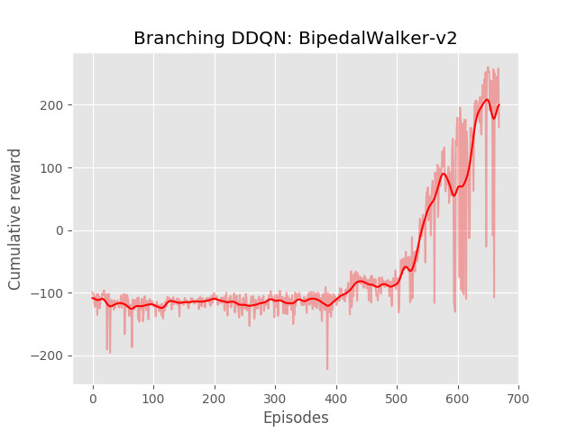

# Branching DQN 

This repo holds an implementation of a PyTorch version of Branching Double Deep Q-Learning. It is based on my other repo for Double DQN: https://github.com/mome36/DoubleDQN and on the paper https://arxiv.org/pdf/1711.08946.pdf

Branching DQN allows a Q-Learning agent to select multiple actions simultaneously. It can be used for continuous control, as I've demonstrated in `BipedalWalker-v2` or for controlling a video game character (yielding actions sur as Jump and Hit instead of Jump or Hit). 


## How to use: 

To train an agent, run: 

```bash
python dueling_dqn.py --env BipedalWalker-v2
```

To see the agent perform: 
```bash
python enjoy.py --env BipedalWalker-v2
```

## Performances


